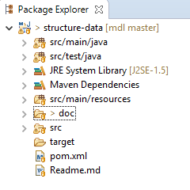

# Project Installation

* Create folder _C:\mdl-workspace\mdl_ and go into it.

* Verify git local repository

>git verion

* If no git local repository, create it

>git init

* Check git remote repository url

>git config --get remote.origin.url

* If no remote repository, add it

>git remote add origin https://github.com/JxSrcInc/mdl.git

* If remote repository url is different from the above, change it

>git remote set-url origin https://github.com/JxSrcInc/mdl.git

* Pull code from remote repository

>git pull origin master

You will see README.md and project directories in the current directory.

If you import the project into Eclips as Maven project, you will see

[back](https://github.com/JxSrcInc/mdl/tree/master/structure-data) to previous page
