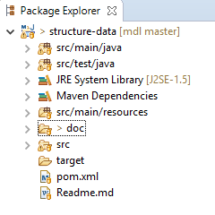

# Structure Data vs Flat Data

[Install instruction](doc/install.md) for git beginner.

>We use Eclipse as IDE in discussions below. After importing the project into Eclipse as Maven project and you will see

