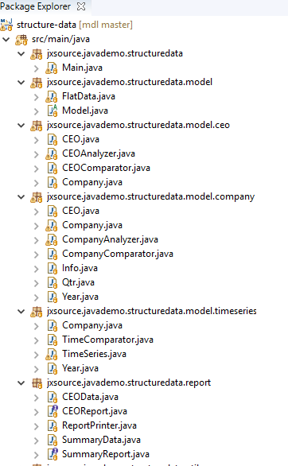

>We use Eclipse as IDE in discussions below. After importing the project into Eclipse as Maven project and you will see

_Main_ is the entry of this project. You can run it and see all outputs.

_FlatData_ matches row in data.csv file in src/main/resources. It has 9 fields and two static functions to read and write data from and to the file.

_Model_ is an abstract class. It has a protected and static _List<FlatData>_, which stores loaded data from external data file, and is used by derived classes to create different structure data.

Each _jxsource.javademo.structuredata.model_ sub package: _company_ and _timeseries_, and _ceo_ contains classes for a separate structured data model. Each structure data is created by an _Analyzer_ class in the corresponding package, which is a sub class of Model and uses _List<FlatData>_ defined in the super _Model_ class. Note, although all _Analyzer_ classes have the same Name, their implementations are different (See their different code). In other words, you can use one String, like _Analyzer_, to name many different classes in different packages. Because a class is identified by its name and its package name, _Analyzer_ in different packages are handled separately by Java Virtual Machine (JVM). It is what people say to distinguish class by name space. But class names in the same package must be different. It is the same for _FlatDataComparator_, which Analyzer uses to sort _List<FlatData>_. Although all _FlatDataComparators_ have the same name, their implementations are different. 

_company_ has a structure: Company -> Year -> Qtr -> Info.

_Timeseries_ has a structure: Year -> Company.

_CEO_ has a structure: CEO -> Company.

There are two interfaces: _SummayReport_ and _CEOReport_. ceo package _Analyzer_ implements _CEOReport_. timeseries package _Analyzer_ implements _SummaryReport_. company package _Analyzer_ implements both _CEOReport_ and _SummaryReport_.

Note, _ReportPrinter_ methods take _CEOReport_ or _SummaryReport_ interfaces, not _Analyzer_ class, as input argument. This is very common way to use polymorphism in Java programming. 

All _Analyzer_s implements _abstract List<FlatData> getFlatDataList()_ method defined in _Model_ class, which converts different structure data back to _FlatData_ and used by save() method to export data to a file. Note, because company, timeseries and CEO data structures are different, they way convert them back to FlatData are different. To allow _Model.save()_ method to use it when saving different structure data, it is defined as abstract in Model, which allows _Model.save()_ method to call it but leave the implementation for the derived classes.

[back](../Readme.md) to previous page
